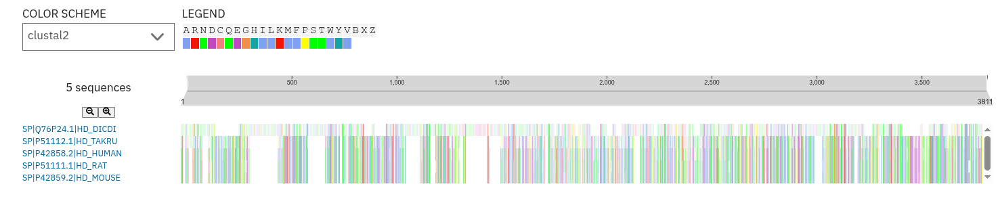

# TP Introducción a la Bioinformática: Parte 1 y 2

Elegimos para realizar el trabajo la **Enfermedad de Huntington (HD)**, catalogada en OMIM con el código [#143100](https://www.omim.org/entry/143100?search=Huntington&highlight=huntington). El gen asociado es **HTT** (Huntingtin), ubicado en el cromosoma 4p16.3. La secuencia de referencia utilizada es el transcripto [NM_001388492.1](https://www.ncbi.nlm.nih.gov/nuccore/NM_001388492.1) (huntingtina isoforma 1, Homo sapiens), obtenida de la base de datos [NCBI Gene](https://www.ncbi.nlm.nih.gov/gene/3064) en formato GenBank.

**Trabajo realizado por:**
- Damian Ariel Masi
- Marcos Rivitti
- Ruben Omar Scarazzato
- Eitan Wajsberg

&nbsp;

## La Enfermedad de Huntington y el gen HTT

### ¿Qué es la Enfermedad de Huntington?
La Enfermedad de Huntington es una enfermedad hereditaria que afecta al cerebro y por el momento no tiene cura. Las personas que la tienen van perdiendo el control de sus movimientos (hacen movimientos involuntarios llamados corea), se les va deteriorando la memoria y el pensamiento, y también tienen cambios de conducta y estado de ánimo. Los síntomas suelen aparecer entre los 30 y 50 años, y una vez que aparecen la enfermedad avanza sin parar. En promedio, las personas viven entre 15 y 20 años más después del diagnóstico.

### Información por niveles
Para entender esta enfermedad desde el punto de vista bioinformático, hay que mirarla en distintos niveles, desde el ADN hasta la función de la proteína que produce.

1. **SNP ([dbSNP - NCBI](https://www.ncbi.nlm.nih.gov/snp/?term=htt)):**
Los SNPs son variaciones de una sola letra en el ADN entre distintas personas. En el gen HTT hay muchos SNPs documentados, pero la causa de la enfermedad no es un SNP: es una expansión de un triplete (ver sección de mutación más abajo).
 
2. **Secuencia nucleotídica ([NCBI Nucleotide](https://www.ncbi.nlm.nih.gov/nuccore/NG_009378.1)):**
El gen HTT está en el cromosoma 4, en la posición 4p16.3. Ocupa aproximadamente 180.000 pares de bases y tiene 67 exones. Es un gen muy grande.
 
3. **Gen ([NCBI Gene - HTT](https://www.ncbi.nlm.nih.gov/gene/3064)):**
HTT es el símbolo oficial del gen. También se lo conoce como HD o IT15. A partir de este gen se produce la proteína huntingtina y es esencial para el desarrollo normal del organismo.
 
4. **ARNm ([NCBI Nucleotide - NM_001388492.1](https://www.ncbi.nlm.nih.gov/nuccore/NM_001388492.1)):**
El transcripto que usamos en este TP es el NM_001388492.1 (huntingtina isoforma 1, humana), que tiene 13.472 bases. Este es el ARNm sin intrones, que la célula usa para fabricar la proteína.
 
5. **Secuencia primaria de proteína ([NCBI Protein](https://www.ncbi.nlm.nih.gov/protein/NP_001375421.1)):**
La proteína huntingtina (HTT) tiene 3.142 aminoácidos. Es una de las proteínas más grandes del organismo humano.
 
6. **Estructura de la proteína ([RCSB PDB](https://www.rcsb.org/structure/8R2O)):**
La huntingtina es una proteína muy grande y su estructura tridimensional completa todavía no está del todo resuelta. Se conocen algunas partes, pero entender cómo se dobla en su totalidad sigue investigándose.
 
7. **Función de la proteína ([UniProt](https://www.uniprot.org/uniprot/P42858)):**
La huntingtina está presente en casi todos los tejidos del cuerpo, pero principalmente en el cerebro. Su función exacta todavía no se entiende del todo, pero se sabe que es esencial para que el organismo se desarrolle con normalidad y para que las neuronas funcionen bien.

### La mutación que causa la enfermedad
La Enfermedad de Huntington tiene una sola mutación conocida como causa: **una expansión del triplete CAG en el exón 1 del gen HTT**.

> ¿Qué significa esto? En el ADN hay una región donde la secuencia CAG se repite varias veces seguidas. En personas sanas, este triplete se repite entre 9 y 35 veces. Cuando el número de repeticiones supera cierto umbral, la persona desarrolla la enfermedad. Cuantas más repeticiones hay, más temprano aparecen los síntomas.
 
| Repeticiones CAG | Qué significa |
|---|---|
| 9 – 26 | Normal, no hay enfermedad |
| 27 – 35 | Normal, pero puede expandirse al pasarlo a los hijos |
| 36 – 39 | Zona gris: puede o no desarrollar HD dependiendo de otros factores |
| 40 o más | La persona va a desarrollar HD inevitablemente |
| 60 o más | Forma juvenil: los síntomas aparecen antes de los 20 años |
 
Cada triplete CAG codifica para el aminoácido glutamina (Q). Entonces, una expansión de CAG produce una cadena de glutaminas anormalmente larga en la proteína. Esa cadena larga hace que la proteína se doble mal y forme grumos tóxicos dentro de las neuronas, especialmente en una zona del cerebro llamada estriado, que es clave para controlar el movimiento.

### Cómo se hereda
La Enfermedad de Huntington se hereda de forma **autosómica dominante**. Esto significa:
- El gen HTT está en un autosoma (cromosoma 4), no en los cromosomas sexuales X o Y.
- Con una sola copia mutada alcanza para desarrollar la enfermedad. No hace falta que las dos copias estén afectadas.
- Si uno de tus padres tiene HD, tenés un 50% de chance de heredar la mutación.
- Afecta por igual a hombres y mujeres.

Esto la diferencia de enfermedades ligadas al cromosoma X, como el daltonismo, donde los hombres son mucho más afectados porque solo tienen un cromosoma X. En el caso de HD, como el gen está en el cromosoma 4 y todos tenemos dos copias de ese cromosoma, el riesgo es el mismo para todos.

### Curiosidad: anticipación genética
La enfermedad puede aparecer más temprano y de forma más grave en cada generación. Esto pasa porque el número de repeticiones CAG tiende a aumentar cuando el gen se transmite de padres a hijos, especialmente cuando lo pasa el padre. Por ejemplo, un padre con 42 repeticiones puede transmitirle a su hijo una versión con 50 o más, lo que acorta el tiempo hasta que aparecen los síntomas. Esto se llama **anticipación genética**.

&nbsp;

## Implementación del Trabajo

### Estructura del repositorio
```
tp-introduccion-bioinformatica/
├── README.md
├── .gitignore
├── data/
│   ├── sequence.gb            # Archivo GenBank del mRNA de referencia del gen HTT (NM_001388492.1)
│   ├── ORFs_HTT.fas           # Los 6 marcos de lectura traducidos a aminoácidos
│   ├── HTT_correcto.fas       # Solo el marco de lectura correcto (+2)
│   ├── humano.fasta           # Secuencia proteína huntingtina Homo sapiens (P42858)
│   ├── raton.fasta            # Secuencia proteína huntingtina Mus musculus (P42859)
│   ├── rata.fasta             # Secuencia proteína huntingtina Rattus norvegicus (P51111)
│   ├── pez_globo.fasta        # Secuencia proteína huntingtina Takifugu rubripes (P51112)
│   ├── dictyostelium.fasta    # Secuencia proteína huntingtina Dictyostelium discoideum (Q76P24)
│   └── secuencia_msa.fasta    # Las 5 secuencias juntas para el alineamiento múltiple
├── scripts/
│   ├── verificar_entorno.sh   # Script para verificar que el entorno está correctamente instalado
│   ├── Ex1.pl                 # Ejercicio 1: procesamiento de secuencias y traducción
│   ├── Ex2_local.pl           # Ejercicio 2: BLAST local contra SwissProt
│   └── Ex2_remoto.pl          # Ejercicio 2: BLAST remoto contra servidor NCBI
└── results/
    ├── blast_local.out        # Resultado del BLAST local
    ├── blast_remoto.out       # Resultado del BLAST remoto
    ├── fasta.out              # Resultado del FASTA online (EBI)
    ├── msa.out                # Resultado del alineamiento múltiple (Clustal Omega)
    └── grafico_msa.png        # Visualización gráfica del alineamiento múltiple
```
> La carpeta `blast_db/` con la base de datos SwissProt no se incluye en el repositorio por su tamaño, pero tener en cuenta que es necesario para correrlo en local.

### Modo de uso de los scripts
Todos los scripts deben ejecutarse siempre desde la raíz del repositorio, no desde dentro de la carpeta `scripts/`. Esto garantiza que las rutas de input y output funcionen correctamente. Ejemplo de uso correcto:
```bash
cd tp-introduccion-bioinformatica
perl scripts/Ex1.pl data/sequence.gb
```

&nbsp;

## Ejercicio 1: Procesamiento de secuencias

### ¿Qué hace el script?
El script `Ex1.pl` lee un archivo GenBank de un mRNA de referencia, genera los 6 marcos de lectura posibles, traduce cada uno a su secuencia de aminoácidos, e identifica cuál es el marco de lectura correcto usando la anotación CDS que viene incluida en el archivo GenBank. Los resultados se escriben en un archivo FASTA.

### ¿Qué es un marco de lectura?
El mRNA es una cadena de nucleótidos que se lee de a 3 (codones) para producir aminoácidos. Dependiendo desde qué posición se empiece a leer, se obtienen proteínas completamente distintas. Hay 3 posiciones posibles en la hebra directa (+1, +2, +3) y 3 en la hebra complementaria inversa (-1, -2, -3), dando un total de 6 marcos de lectura posibles. Solo uno de ellos es el correcto y produce la proteína real.

En los marcos incorrectos aparecen codones de stop prematuros (representados como `*`) que cortarían la traducción antes de tiempo. El marco correcto es el que produce una secuencia de aminoácidos continua y coherente, sin esos stops prematuros. Lo que buscamos dentro de ese marco se llama **ORF (Open Reading Frame)**: una región que empieza con un codón de inicio (ATG) y termina con un codón de stop. Encontrar el ORF correcto es equivalente a encontrar el marco de lectura que usa la naturaleza para fabricar esa proteína.

### Ejecución
```bash
perl scripts/Ex1.pl data/sequence.gb
```

### Output generado
```
data/ORFs_HTT.fas
```

### Resultado
El marco de lectura correcto identificado es el +2, lo que significa que la secuencia codificante del gen HTT comienza en la segunda posición del mRNA. Esto coincide con la anotación CDS del archivo GenBank de referencia.

Para los ejercicios siguientes se extrajo solo la secuencia del marco correcto con este comando:
```bash
awk '/^>.*frame_\+2_MARCO_CORRECTO/{p=1} /^>/ && !/frame_\+2_MARCO_CORRECTO/{p=0} p' data/ORFs_HTT.fas > data/HTT_correcto.fas
```

Lo que hace es buscar en el archivo FASTA la secuencia que tiene `frame_+2_MARCO_CORRECTO` en su nombre y guardarla en un archivo nuevo llamado `HTT_correcto.fas`.

&nbsp;

## Ejercicio 2.a: BLAST

### ¿Qué hacen los scripts?
Los scripts `Ex2_local.pl` y `Ex2_remoto.pl` toman como input la secuencia de aminoácidos del marco de lectura correcto y realizan una búsqueda BLAST contra la base de datos SwissProt para encontrar secuencias similares en otros organismos.

Se implementaron dos variantes:
- **BLAST local:** corre directamente en la máquina usando la base de datos SwissProt descargada localmente. Es más rápido y no depende de la conexión.
- **BLAST remoto:** envía la secuencia al servidor del NCBI y espera la respuesta. No requiere tener la base de datos instalada pero puede tardar varios minutos.
Además, siguiendo la sugerencia del profesor, también se corrió una búsqueda **FASTA online** contra SwissProt usando el servidor del EBI, para comparar los resultados con los del BLAST.
 
### Ejecución
#### BLAST local
 ```bash
 perl scripts/Ex2_local.pl data/HTT_correcto.fas blast_db/swissprot
 ```

#### BLAST remoto
```bash
perl scripts/Ex2_remoto.pl data/HTT_correcto.fas
```

#### FASTA online
Se corrió desde el [servidor del EBI](https://www.ebi.ac.uk/jdispatcher/sss/fasta) usando la secuencia de `data/HTT_correcto.fas` contra la base de datos UniProtKB/Swiss-Prot. Los resultados completos están disponibles en [este link](https://www.ebi.ac.uk/jdispatcher/sss/fasta/summary?jobId=fasta-I20260524-020009-0240-63843314-p2m).

### Outputs generados
```
results/blast_local.out
results/blast_remoto.out
results/fasta.out
```

### Resultados BLAST
Los 5 hits encontrados son todos los hits significativos que existen en SwissProt para la huntingtina con el umbral de E-value utilizado (1e-5). No es una limitación del script: simplemente la huntingtina es una proteína muy específica y poco conservada fuera de ciertos organismos.

| Hit | Organismo | Identidad | E-value | Score |
|-----|-----------|-----------|---------|-------|
| P42858.2 | Homo sapiens (humano) | 100.0% | 0.0 | 16733 |
| P42859.2 | Mus musculus (ratón) | 91.2% | 0.0 | 14691 |
| P51111.1 | Rattus norvegicus (rata) | 90.8% | 0.0 | 14625 |
| P51112.1 | Takifugu rubripes (pez globo) | 71.5% | 0.0 | 11540 |
| Q76P24.1 | Dictyostelium discoideum | 31.1% | 8e-19 | 245 |

Los resultados del BLAST local y remoto son consistentes entre sí: los mismos 5 hits en el mismo orden. Las pequeñas diferencias en scores y E-values entre ambas variantes son normales y se deben a que el servidor del NCBI puede usar una versión levemente distinta de la base de datos.
 
### Resultados FASTA y comparación con BLAST
Los primeros 4 hits del FASTA coinciden exactamente con los del BLAST: humano (100%), ratón (90.5%), rata (90.1%) y pez globo (69.8%), en el mismo orden. Esto confirma que esos resultados son sólidos y reproducibles con distintos algoritmos.

La diferencia más interesante aparece en el quinto hit. BLAST encontró la huntingtina de *Dictyostelium discoideum* (Q76P24.1) con un E-value de 8e-19, que es muy significativo. FASTA también encuentra esa misma proteína, pero la ubica en el puesto 24 con un E-value de 0.91, que no se considera significativo. Esta diferencia se explica porque BLAST es más sensible que FASTA para detectar similitudes lejanas entre proteínas muy largas. En este caso, hay que confiar más en el resultado del BLAST: la similitud con la huntingtina de *Dictyostelium* es real y tiene significado biológico.

&nbsp;

## Ejercicio 2.b: Interpretación del resultado del BLAST

### Significado de los valores
La combinación de un score alto, un E-value cercano a cero y una identidad elevada es la señal más confiable de que dos proteínas están genuinamente relacionadas evolutivamente.

1. **Score:** es un número que refleja qué tan bien se alinean dos secuencias. Se calcula sumando puntos por cada posición donde los aminoácidos coinciden o son similares, y restando puntos por los gaps (espacios que se introducen para alinear mejor). Cuanto más alto el score, mejor el alineamiento.
 
2. **E-value:** es el valor estadístico más importante del BLAST. Representa cuántos alineamientos con ese score o mejor se esperaría encontrar por pura casualidad en una base de datos del tamaño de SwissProt. Cuanto más chico el E-value, más seguro es que la similitud encontrada no es producto del azar. Un E-value de 8e-19 sigue siendo extremadamente significativo aunque la similitud sea menor. Como regla general, se considera significativo cualquier E-value menor a 0.001.

3. **Identidad:** es el porcentaje de posiciones en el alineamiento donde los dos aminoácidos son exactamente iguales. Un 100% indica que las secuencias son idénticas. Un 31.1% puede parecer bajo, pero en proteínas largas con E-values tan pequeños, ese nivel de identidad es suficiente para concluir que las proteínas comparten un ancestro común y probablemente funciones similares.

### Las secuencias encontradas
1. El primer hit es la huntingtina humana (P42858.2) con 100% de identidad, lo cual confirma que la secuencia que estamos analizando es correcta y corresponde exactamente a la proteína HTT humana almacenada en SwissProt.

2. Los hits 2 y 3 son la huntingtina de ratón y rata, con identidades del 91.2% y 90.8% respectivamente. Esto refleja la alta conservación evolutiva de esta proteína entre mamíferos: el gen HTT es esencial para el desarrollo neurológico y ha sido muy conservado a lo largo de la evolución.

3. El hit 4, el pez globo (Takifugu rubripes), muestra una identidad del 71.5%. A pesar de ser un vertebrado mucho más distante evolutivamente que los mamíferos, la proteína sigue siendo reconociblemente similar, lo que indica que HTT cumple funciones fundamentales conservadas en todos los vertebrados.

4. El hit 5, Dictyostelium discoideum, es el más interesante. Es un organismo unicelular primitivo sin ningún parentesco con los animales. Con solo 31.1% de identidad pero un E-value de 8e-19, la similitud sigue siendo estadísticamente muy significativa. Esto sugiere que algunas regiones funcionales de la huntingtina ya existían en organismos muy primitivos, antes de la aparición de los animales multicelulares.

&nbsp;

## Ejercicio 3: Alineamiento Múltiple (MSA)
 
### ¿Qué es un alineamiento múltiple?
Un alineamiento múltiple (MSA) permite comparar varias secuencias de proteínas al mismo tiempo, alineando las posiciones equivalentes entre todos los organismos. Esto permite identificar qué regiones de la proteína se mantuvieron iguales a lo largo de millones de años de evolución (regiones conservadas) y cuáles cambiaron. Las regiones muy conservadas suelen ser las más importantes funcionalmente: si la proteína las mantuvo en organismos tan distintos, es porque son esenciales para que funcione.
 
### Secuencias utilizadas
Las secuencias fueron descargadas en formato FASTA desde NCBI Protein:
 
- [P42858](https://www.ncbi.nlm.nih.gov/protein/P42858) — *Homo sapiens* (humano)
- [P42859](https://www.ncbi.nlm.nih.gov/protein/P42859) — *Mus musculus* (ratón)
- [P51111](https://www.ncbi.nlm.nih.gov/protein/P51111) — *Rattus norvegicus* (rata)
- [P51112](https://www.ncbi.nlm.nih.gov/protein/P51112) — *Takifugu rubripes* (pez globo)
- [Q76P24](https://www.ncbi.nlm.nih.gov/protein/Q76P24) — *Dictyostelium discoideum*

Una vez descargadas, se juntaron en un solo archivo con el siguiente comando:
```bash
cat humano.fasta raton.fasta rata.fasta pez_globo.fasta dictyostelium.fasta > data/secuencia_msa.fasta
```

### Herramienta utilizada
Se usó **Clustal Omega** del servidor del EBI. Los resultados completos están disponibles en [este link](https://www.ebi.ac.uk/jdispatcher/msa/clustalo/summary?jobId=clustalo-I20260525-193425-0152-55451491-p1m). El resultado también se guardó localmente en `results/msa.out`.

### Ejecución
El alineamiento se realizó online desde:
https://www.ebi.ac.uk/jdispatcher/msa/clustalo, donde ingresamos el archivo `data/secuencia_msa.fasta`.

### Output generado
```
results/msa.out
```

### Interpretación del resultado
El alineamiento muestra un patrón claro que se divide en dos grupos:

1. **Alta conservación entre vertebrados:** humano, ratón, rata y pez globo presentan bloques extensos de posiciones idénticas o muy similares, indicados por `*` y `:` en el alineamiento. Esto confirma que la huntingtina es una proteína muy conservada entre vertebrados, lo que sugiere que cumple funciones esenciales que no pueden cambiar sin afectar la supervivencia del organismo.

2. **Conservación parcial con *Dictyostelium*:** la huntingtina de *Dictyostelium discoideum* es mucho más divergente, con muchos gaps y regiones sin correspondencia. Sin embargo, en varios bloques dispersos a lo largo de toda la proteína aparecen posiciones conservadas entre *Dictyostelium* y los vertebrados. Esto indica que ciertas regiones funcionales de la huntingtina existían ya en organismos unicelulares primitivos, antes de la aparición de los animales.

En conjunto, el MSA refuerza las conclusiones del BLAST: la huntingtina es una proteína antigua y conservada, especialmente en vertebrados, con un núcleo funcional que se remonta a organismos muy primitivos.

### Ejemplo representativo del alineamiento
El siguiente bloque muestra una de las regiones con mayor conservación entre los 5 organismos:

```
sp|Q76P24.1|HD_DICDI      FPRFLSIAISLLLRAHGDKDLNVYSVAEESLNRTIKILVYSYHERILFELFKVLKGKPHQ	107
sp|P51112.1|HD_TAKRU      FQKLLGIAMEMFLLCSDDSESDVRMVADECLNRIIKALMDSNLPRLQLELYKEIKKNG--	123
sp|P42858.2|HD_HUMAN      FQKLLGIAMELFLLCSDDAESDVRMVADECLNKVIKALMDSNLPRLQLELYKEIKKNG--	178
sp|P51111.1|HD_RAT        FQKLLGIAMELFLLCSDDA-SRRRMVADECLNKVIKALMDSNLPRLQLELYKEIKKNG--	148
sp|P42859.2|HD_MOUSE      FQKLLGIAMELFLLCSNDAESDVRMVADECLNKVIKALMDSNLPRLQLELYKEIKKNG--	157
                          * ::*.**:.::* . .*       **:*.**: ** *: *   *: :**:* :* :   
```

Los símbolos de la última línea indican: `*` posición idéntica en los 5 organismos, `:` posición muy similar, `.` posición con cierta similitud. Se puede ver claramente que humano, ratón, rata y pez globo son casi idénticos en esta región, mientras que *Dictyostelium* diverge bastante pero comparte algunas posiciones clave, lo que refuerza la idea de un núcleo funcional ancestral.

### Visualización del alineamiento múltiple
La siguiente captura muestra la vista completa del alineamiento en el visualizador del EBI. Cada color representa un aminoácido distinto. Se puede ver claramente cómo las 4 secuencias de vertebrados (pez globo, humano, rata y ratón) tienen patrones de color muy similares a lo largo de toda la proteína, mientras que Dictyostelium (primera fila) muestra muchas más diferencias y gaps, especialmente en la región central.



&nbsp;

## Ejercicio 4 - Análisis del reporte BLAST por patrón

El script `Ex4.pl` lee el reporte de BLAST generado en el Ejercicio 2 y busca, entre los hits, aquellos cuya descripción contenga un patrón de texto dado por parámetro (por ejemplo, el nombre de un organismo).

**Uso:**

```bash
perl scripts/Ex4.pl results/blast_local.out "Mus musculus" results/ex4
```

Parámetros:
1. Archivo de salida de BLAST a analizar.
2. Patrón a buscar en la descripción de los hits (no distingue mayúsculas/minúsculas).
3. Prefijo para los archivos de salida (opcional).

**Salidas:**
- `results/ex4_hits.out`: listado de los hits que coinciden con el patrón, con su Accession, descripción, Score y E-value.
- `results/ex4_sequences.fas`: secuencias completas de esos hits, descargadas desde GenBank (punto extra).

### Resultado

Usando como patrón **"Mus musculus"** sobre `blast_local.out`, se encontró 1 hit:

| Accession | Descripción | Score | E-value |
|-----------|-------------|-------|---------|
| P42859.2 | Huntingtin [Mus musculus] | 14691 | 0.0 |

### Punto extra: descarga de la secuencia completa

Para descargar la secuencia completa con `Bio::DB::GenBank` hizo falta un paso intermedio: el accession del hit (`P42859.2`) es un identificador de UniProt, y GenBank no lo reconoce directamente. Por eso, el script primero consulta UniProt con `Bio::DB::SwissProt` para obtener el accession equivalente en GenBank (`L23312`), y con ese accession descarga la secuencia completa (mRNA de ratón, 9992 nucleótidos), que queda guardada en `results/ex4_sequences.fas`.

&nbsp;

## Ejercicio 5 - EMBOSS

El script `Ex5.pl` usa dos programas de EMBOSS para analizar la secuencia del gen HTT.

**Uso:**

```bash
perl scripts/Ex5.pl data/HTT_correcto.fas
```

Si no encontrás la base de datos PROSITE en `data/prosite.dat`, el script la descarga automáticamente.

### getorf — búsqueda de ORFs en el mRNA

Primero, el script convierte `data/sequence.gb` a FASTA de nucleótidos usando `seqret` (otro programa de EMBOSS), y luego corre `getorf` para encontrar todos los ORFs que empiezan con Met y tienen al menos 100 aminoácidos, en los 6 marcos de lectura posibles.

Se encontraron 8 ORFs. El más relevante es el **ORF 1** (posiciones 146–9571), que corresponde a la proteína huntingtina completa de 3144 aa (el mismo marco +2 que identificamos en el Ejercicio 1).

### patmatmotifs — búsqueda de dominios PROSITE

Luego, el script corre `patmatmotifs` sobre la secuencia de aminoácidos (`data/HTT_correcto.fas`) para buscar motivos y dominios funcionales conocidos en la base de datos PROSITE. Se encontraron 4 motivos:

| Motivo | Posición | Descripción |
|--------|----------|-------------|
| AMIDATION | 1578–1581 | Sitio de amidación C-terminal |
| AMIDATION | 2591–2594 | Sitio de amidación C-terminal |
| LEUCINE_ZIPPER | 1492–1513 | Patrón de leucine zipper |
| TYR_PHOSPHO_SITE_2 | 2762–2769 | Sitio de fosforilación por tirosina kinasa |

Los reportes completos están en `results/ex5_orfs.out` y `results/ex5_dominios.out`.

### Análisis adicional con InterPro

También analizamos la secuencia de la huntingtina en [InterPro](https://www.ebi.ac.uk/interpro/),
que integra múltiples bases de datos de dominios (Pfam, PRINTS, PANTHER, entre otras) en una
sola búsqueda.

Los resultados los obtuvimos ingresando la secuencia de `data/HTT_correcto.fas` en
https://www.ebi.ac.uk/interpro/search/sequence/. De todos los resultados devueltos, mostramos
solo los dominios que tienen una entrada asignada en InterPro, que son los más relevantes:

| Base de datos | Dominio | Posición | Descripción |
|---------------|---------|----------|-------------|
| PANTHER | IPR028426 | 49–3181 | Familia Huntingtin, cubre casi toda la proteína |
| PRINTS | IPR000091 | múltiples | Firma característica de Huntingtin (6 regiones) |
| Pfam | IPR048411 | 180–330 | Repeticiones HEAT N-terminal tipo 1 |
| Pfam | IPR024613 | 804–1679 | Repeticiones HEAT N-terminal tipo 2 |
| Pfam | IPR048413 | 2140–3146 | Repeticiones HEAT C-terminal |
| Pfam | IPR048412 | 1833–2110 | Región "bridge" entre dominios HEAT |
| GENE3D/SUPERFAMILY | IPR016024 | múltiples | Pliegue tipo ARM |

Las repeticiones HEAT son el rasgo estructural más importante de la huntingtina: son bloques
repetidos de alfa-hélices que le permiten a la proteína interactuar con muchas otras proteínas
dentro de la célula. Su presencia en casi toda la longitud de la proteína explica por qué HTT
participa en tantos procesos biológicos distintos.

Comparado con el análisis de PROSITE (que encontró solo 4 motivos genéricos), InterPro da
una imagen mucho más completa y específica de la estructura funcional de la proteína.

&nbsp;

## Ejercicio 6 - Bases de Datos Biológicas

### a) Gen de interés en el NCBI

- **Gen:** HTT (Huntingtin)
- **Organismo:** Homo sapiens
- **Link:** https://www.ncbi.nlm.nih.gov/gene/3064

La huntingtina es una proteína grande (3144 aminoácidos) presente en casi todos los tejidos del cuerpo, pero especialmente en el cerebro. No tiene una función única, sino que interactúa con muchas otras proteínas y participa en procesos como el transporte de vesículas, la supervivencia neuronal y la regulación de la expresión génica.

Como ya explicamos anteriormente, la elegimos porque es la proteína responsable de la enfermedad de Huntington, una enfermedad neurodegenerativa hereditaria que lleva a la pérdida de control motor, deterioro cognitivo y eventualmente la muerte.

### b) Genes/proteínas homólogas en otros organismos

Un gen **homólogo** es un gen que viene de un mismo ancestro común. Dentro de los homólogos
existen los genes **ortólogos**. Dos genes son ortólogos cuando se originaron a partir de un
mismo gen ancestral, después de que una especie se dividió en dos a lo largo de la evolución.

- En **NCBI** (https://www.ncbi.nlm.nih.gov/datasets/gene/3064/#orthologs) encontramos **846
genes ortólogos** de HTT. La lista incluye organismos muy variados: otros primates (chimpancé,
marmoset, macaco), roedores (ratón, rata, hámster), otros mamíferos (vaca, oveja, perro, cerdo,
caballo) y también vertebrados que no son mamíferos, como el pez cebra, la rana y el pollo.
- En **Ensembl** (https://www.ensembl.org/Homo_sapiens/Gene/Compara_Ortholog?db=core;g=ENSG00000197386)
encontramos **206 ortólogos**, bastante menos que en NCBI. Pero Ensembl también encontró
ortólogos en invertebrados, como la mosca de la fruta (*Drosophila melanogaster*, 16.8% de
identidad) y el gusano *Caenorhabditis elegans* (18.9% de identidad). Esto nos dice que HTT es
un gen muy antiguo, que ya estaba presente antes de que se separaran los linajes de insectos,
gusanos y vertebrados. Por otro lado, no se encontró ningún ortólogo en la levadura
(*Saccharomyces cerevisiae*), lo que tiene sentido porque HTT parece haber aparecido recién con
la evolución de los animales.

#### ¿En qué se diferencian estas bases de datos?

NCBI da una lista más simple, centrada en vertebrados, con datos básicos por organismo
(símbolo del gen, cromosoma, accession, longitud de la proteína). Ensembl cubre un rango
taxonómico más amplio, llegando hasta invertebrados, y da mucho más detalle por cada
ortólogo: porcentaje de identidad, tipo de relación entre los genes (uno a uno, uno a muchos,
etc.) y nivel de confianza de la asignación.

#### ¿Qué tan comunes son estos genes?

HTT tiene cientos de ortólogos identificados, lo que indica que es un gen muy conservado a lo
largo de la evolución. No es un gen exclusivo de unas pocas especies, sino que está presente en
prácticamente todos los animales vertebrados, y también en varios invertebrados.

#### ¿A qué grupos taxonómicos pertenecen?

Los ortólogos de HTT aparecen en mamíferos, aves, reptiles, anfibios y peces, y también en
invertebrados como insectos (mosca de la fruta). No se encontró en hongos como la levadura, lo que sugiere que el gen apareció en algún punto temprano de la evolución de los animales y se mantuvo conservado desde entonces.

### c) Transcriptos y splicing alternativo

- En **NCBI** (https://www.ncbi.nlm.nih.gov/datasets/gene/3064/#transcripts-and-proteins) encontramos **2 transcriptos** para HTT: `NM_001388492.1` (13.472 pb, proteína de 3.142 aa, el que usamos en este TP) y `NM_002111.8` (13.498 pb, proteína de 3.144 aa). Ambos codifican prácticamente la misma proteína, con una diferencia de 2 aminoácidos.

- En **Ensembl** (https://www.ensembl.org/Homo_sapiens/Gene/TranscriptComparison?db=core;g=ENSG00000197386;r=4:3041363-3243957) encontramos **24 transcriptos**. De esos, solo 6 están clasificados como "Protein coding" (codifican una proteína completa): el principal es HTT-201
(`ENST00000355072.11`), que es el mismo que reporta NCBI. Los otros 5
son variantes más cortas, con proteínas de distinto tamaño (desde 97 hasta 3.086 aminoácidos).
Los 18 transcriptos restantes no llegan a producir una proteína funcional completa:
10 son "Retained intron" (conservan intrones sin terminar el splicing), 4 son "Nonsense mediated
decay" (tienen errores que activan un mecanismo de degradación) y 4 están marcados como
codificantes pero sin marco de lectura definido.

#### ¿Cuáles se expresan y tienen funciones alternativas?

El transcripto principal (HTT-201/`NM_001388492.1`) es el único con evidencia clara de producir la proteína huntingtina completa. Los otros transcriptos codificantes de Ensembl generan proteínas más cortas, pero no hay evidencia sólida de que tengan funciones distintas. Probablemente sean variantes menos frecuentes o específicas de ciertos tejidos.

#### ¿Cuál base de datos es más precisa?

Ensembl reporta muchos más transcriptos, pero eso no significa que todos sean funcionales. La mayoría no llegan a producir una proteína completa. NCBI, en cambio, es más conservador y muestra solo los transcriptos con evidencia más sólida de funcionalidad. Para este TP, NCBI nos parece más claro y confiable para identificar los transcriptos funcionales, mientras que Ensembl sirve más para ver toda la variabilidad de splicing del gen.

### d) Interacciones proteína-proteína

En **NCBI Gene** (https://www.ncbi.nlm.nih.gov/gene/3064#interactions) encontramos alrededor de **560 interacciones** reportadas para HTT. En **UniProt** (https://www.uniprot.org/uniprotkb/P42858/entry#interaction) también aparece una gran cantidad de interacciones asociadas. Muchas de ellas están relacionadas con el funcionamiento de las neuronas y con procesos asociados a enfermedades neurodegenerativas.

Por ejemplo, aparecen varias proteínas relacionadas con muerte celular. Esto es interesante porque la enfermedad de Huntington produce una pérdida progresiva de neuronas. También aparecen interacciones vinculadas con:

* comunicación y señalización entre células
* transporte de sustancias dentro de la célula
* eliminación de proteínas dañadas
* respuesta al estrés celular
* organización y movimiento interno de la célula

Otra interacción interesante es que HTT puede interactuar consigo misma. Esto es importante porque en la enfermedad de Huntington la proteína mutada tiende a acumularse y formar estructuras anormales dentro de las neuronas.

En UniProt también aparecen proteínas relacionadas con otras enfermedades neurodegenerativas, como una proteína asociada a la enfermedad de Alzheimer.

Además, en NCBI aparece una interacción entre HTT y una proteína del virus HIV-1, el virus que causa el SIDA. Nos resultó interesante porque muestra que huntingtina también puede interactuar con proteínas virales, no solamente con proteínas humanas.

### e) Gene Ontology (GO)

Según la información de **NCBI Gene** (https://www.ncbi.nlm.nih.gov/gene/3064#general-gene-info), **UniProt** (https://www.uniprot.org/uniprotkb/P42858/entry#function) y **Gene Ontology (GO)** (https://amigo.geneontology.org/amigo/search/ontology?q=HTT), la proteína huntingtina (HTT) se encuentra principalmente en el **citoplasma** de la célula y en estructuras relacionadas con el transporte interno, como vesículas y endosomas. También puede encontrarse en el núcleo celular y en partes de las neuronas como axones y dendritas.

Los términos de GO muestran que HTT participa sobre todo en procesos relacionados con el sistema nervioso y el funcionamiento de las neuronas. Entre los procesos biológicos más importantes aparecen:

* desarrollo del sistema nervioso
* generación y mantenimiento de neuronas
* transporte de vesículas dentro de la célula
* organización de estructuras celulares
* regulación de señales celulares
* respuesta al estrés celular
* regulación de apoptosis (muerte celular programada)
* eliminación de proteínas dañadas y reciclaje celular

En cuanto a su función molecular, HTT interactúa con muchas otras proteínas y participa en el transporte y organización interna de la célula. También puede unirse a proteínas del citoesqueleto, proteínas de señalización y proteínas relacionadas con respuesta al estrés.

En general, los resultados de GO muestran que huntingtina tiene un rol muy importante en el funcionamiento y mantenimiento de las neuronas, lo que coincide con el hecho de que su mutación produce la enfermedad de Huntington.
